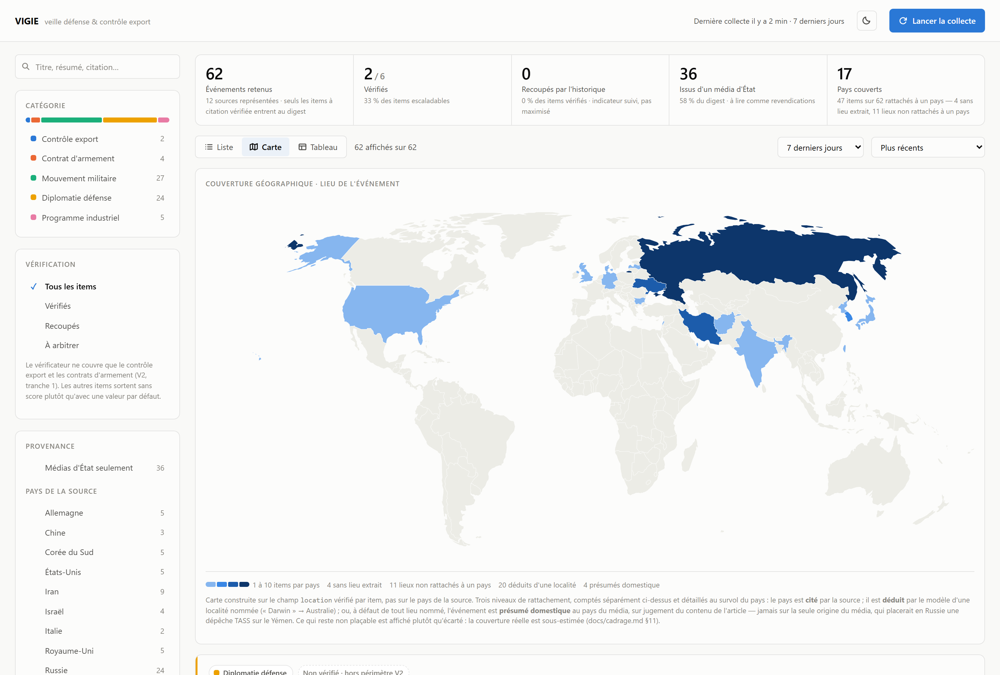
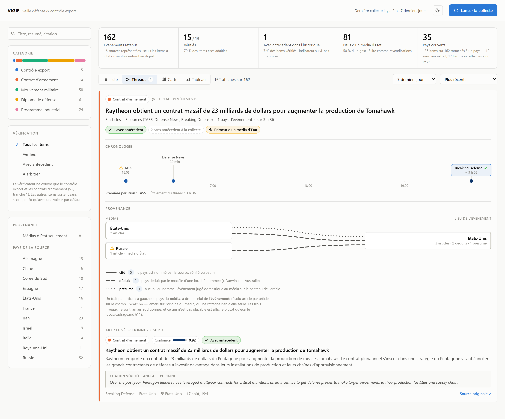

# VEILLE-01 — Agent de veille export & risque défense/géopolitique

[](https://github.com/Adrien-1997/vigie-01/actions/workflows/ci.yml)
[](LICENSE)

Agent IA autonome qui collecte, classe et synthétise quotidiennement des sources ouvertes sur un périmètre défense/géopolitique restreint, avec traçabilité systématique de chaque affirmation vers sa source.

**Statut** : pipeline V1 fonctionnel de bout en bout (collecte → dédoublonnage → classification → vérification → regroupement en threads → API → frontend), première tranche du vérificateur V2 et première tranche du raisonnement longitudinal V3 livrées, déploiement cloud à venir. Détail dans [Roadmap](#roadmap).

Le raisonnement derrière les décisions techniques — garde-fous, invariants de durabilité, règles de
restitution, conduite de la campagne — est dans [`docs/decisions.md`](docs/decisions.md). Le cadrage
produit est dans [`docs/cadrage.md`](docs/cadrage.md).


Chaque fiche porte les signaux qui engagent la confiance — citation vérifiée verbatim, antécédent
trouvé ou non dans l'historique, provenance « média d'État », score du vérificateur — et un item
hors du périmètre du vérificateur sort **sans** score plutôt qu'avec un zéro trompeur.



La carte est construite sur le lieu vérifié de chaque événement, jamais sur le pays de la source,
et affiche ce qu'elle ne peut pas placer plutôt que de surestimer sa couverture. Trois niveaux de
rattachement — cité, déduit, présumé domestique — restent comptés séparément.



Un **thread** rassemble les articles qui couvrent le même dossier — mêmes parties, même opération —
et non le même thème. Sa chronologie est à l'échelle réelle du temps : l'écart entre les parutions
est le signal. Aucun indice de fiabilité n'est agrégé au niveau du thread.

## Cadrage

Cadrage complet — problématique, périmètre MECE, alternatives évaluées, KPIs, matrice de risques, gouvernance, plan de livraison — dans [`docs/cadrage.md`](docs/cadrage.md). Synthèse visuelle : [`docs/slides.html`](docs/slides.html) (support de présentation navigable, ouvrir dans un navigateur).

**Valeur** : diviser le temps de synthèse quotidienne, standardiser la lecture des signaux faibles, tracer la fiabilité de chaque information remontée.

**Périmètre V1** : export control, contrats d'armement, mouvements militaires, diplomatie défense, programmes industriels — filtrage thématique (le lieu est extrait comme métadonnée, sans restreindre la collecte, cf. cadrage §4).

**Sources** : 18 flux RSS gratuits, organisés par pays plutôt que par thème — les 10 premiers exportateurs mondiaux d'armement (classement SIPRI *Trends in International Arms Transfers*, données 2020-24) plus l'Iran et la Corée du Nord pour la couverture export-contrôle. Chaque flux est validé en direct avant intégration ; les sources d'État (seule option gratuite disponible pour plusieurs de ces pays) sont marquées `state_affiliated` et restent visibles comme telles en aval, plutôt que d'être exclues ou mélangées silencieusement au reste. Le volume est plafonné par flux (`MAX_ITEMS_PER_SOURCE_PER_RUN`, cf. Garde-fous ci-dessous) plutôt que par flux à égalité de traitement : sans ce plafond, une agence de presse à cadence élevée épuisait le budget quotidien au détriment des sources spécialisées à plus faible volume mais plus fort signal.

## Architecture

```
Sources (RSS par pays, presse spécialisée, communiqués)
        │
        ▼
  Agent collecteur ──► Mémoire courte ──► Agent analyste
   (backend/agents/     (dédoublonnage,     (classification, résumé,
    collector.py)        avant l'appel LLM)  citation vérifiée)
                          backend/memory/     backend/agents/analyst.py
                          store.py                   │
                                                      ▼
                                            Agent vérificateur
                                            (backend/agents/verifier.py)
                                            recoupement sur l'historique,
                                            score de confiance
                                                      │
                                                      ▼
                                            Agent de regroupement
                                            (backend/agents/threader.py)
                                            threads d'événements sur
                                            l'historique
                                                      │
                                                      ▼
                                     API (FastAPI) ──► Front (digest filtrable,
                                     backend/api/       threads, carte de couverture)
                                     main.py             frontend/ (React + Vite)
```

Implémenté comme un `StateGraph` LangGraph (`backend/graph.py`) : chaque étape est un nœud, l'état partagé (`VeilleState`, `backend/state.py`) transporte les items d'un nœud à l'autre. Le dédoublonnage est placé *avant* l'appel LLM, pas après, pour ne pas consommer de budget sur des items déjà vus. LangSmith trace chaque nœud sans instrumentation manuelle.

Quatre décisions structurent ce pipeline — le digest comme fenêtre glissante et non comme
photographie d'un run, la persistance derrière une interface unique, la séparation volontaire
entre workflow déterministe et boucle agentique, et les divergences assumées du regroupement en
threads. Elles sont documentées dans [`docs/decisions.md`](docs/decisions.md).

## Résultats mesurés

Chiffres datés, et non des cibles. Définitions et réserves méthodologiques en
[`docs/cadrage.md` §7](docs/cadrage.md) ; outillage dans `backend/eval/`.

| Mesure | Résultat | Cible |
|---|---|---|
| Précision de classification (2026-08-16, n=68 annotés) | 51/68 = **75 %** | ≥ 85 % |
| → décision de périmètre seule (dans / hors) | précision 88 %, rappel 83 % (F1 0,86) | — |
| → catégorie fine, sur les items jugés dans le périmètre | 23/36 = 64 % | — |
| Couverture des sources (2026-08-18, fenêtre 96 h) | 16/18 flux actifs | — |
| Items écartés par le plafond par source (même fenêtre) | 279 sur 7 flux | — |
| Historique accumulé (2026-08-18) | 199 items sur 5 jours | — |

La précision globale est **sous la cible**, et sa décomposition est le résultat utile : le filtrage
du bruit atteint la cible, la qualification fine échoue une fois sur trois, et une seule catégorie
porte l'essentiel de l'écart (`programme_industriel`, rappel 5/11). Deux des six manques sont des
cas de troncature de teaser RSS, déjà corrigés au rejeu sur texte intégral — ils relèvent de
l'ingestion, pas du prompt.

Deux mesures antérieures (n=30 puis n=88) et les correctifs de définition qu'elles ont déclenchés
sont détaillés en [§7](docs/cadrage.md). Ce qui n'est **pas** mesuré est dit comme tel : le
vérificateur n'a produit que 15 scores (catégories sensibles seules) et le regroupement un seul
thread de trois items — le critère d'acceptation des threads reste ouvert, faute d'assiette.

## Stack

| Composant       | Choix                                    | Statut                |
|-----------------|-------------------------------------------|------------------------|
| Orchestration   | LangGraph / LangChain                    | construit (V1)          |
| LLM             | Claude Haiku via `langchain-anthropic`   | construit (V1)          |
| Backend         | Python 3.13, FastAPI                     | construit (V1)          |
| Observabilité   | LangSmith (tracing natif par nœud)       | construit (V1)          |
| Frontend        | React + TypeScript + Vite                | construit (V1)          |
| Vérificateur (recoupement, score de confiance) | LangGraph + tool-calling borné | 1ʳᵉ tranche construite (catégories sensibles) |
| Carte de couverture interactive | d3-geo + Natural Earth, sur le champ `location` | construite (V2, 1ʳᵉ tranche) |
| Threads d'événements (regroupement longitudinal) | LangGraph + tool-calling borné, chronologie et provenance côté front | 1ʳᵉ tranche construite (V3) |
| Déploiement     | Cloud Run + Cloud Scheduler (cron)        | prévu                   |
| Stockage        | Fichiers JSON locaux (dev) / Firestore (production), derrière une interface unique | construit en local ; backend Firestore écrit mais **non validé contre une base réelle** |


## Structure du repo

```
vigie/
├── backend/
│   ├── agents/
│   │   ├── collector.py       # collecte RSS par pays, sources validées en direct
│   │   ├── analyst.py         # classification MECE, résumé FR, citation + lieu vérifiés
│   │   ├── verifier.py        # recoupement + score de confiance (boucle tool-calling bornée)
│   │   └── threader.py        # regroupement en threads d'événements (même patron borné)
│   ├── api/
│   │   └── main.py            # FastAPI : /health, /run, /events
│   ├── eval/
│   │   ├── build_sample.py    # échantillon stratifié pour mesurer la précision
│   │   ├── annotate.py        # annotation manuelle interactive
│   │   ├── score.py           # précision mesurée vs cible (cadrage §7)
│   │   └── candidates.py      # densité de candidats de recoupement, sans appel LLM
│   ├── memory/
│   │   ├── store.py           # dédoublonnage + historique analysé (recoupement et digest)
│   │   └── persistence.py     # fichiers JSON locaux (dev) ou Firestore (prod), même interface
│   ├── config.py               # sources RSS par pays, garde-fous obligatoires
│   ├── guardrails.py           # plafond d'appels LLM quotidien
│   ├── graph.py                 # assemblage StateGraph LangGraph
│   ├── state.py                 # schéma d'état partagé (VeilleState)
│   ├── requirements.txt
│   └── requirements-gcp.txt     # dépendance Firestore, déploiement uniquement
├── frontend/                    # React + TypeScript + Vite, appelle l'API réelle
│   └── src/
│       ├── components/          # digest filtrable, threads (chronologie + provenance),
│       │                        #   carte de couverture, vue tableau
│       └── lib/                 # taxonomie, filtres/tri, résolution des lieux, modèle de thread
├── scripts/
│   └── daily_run.py             # lancement quotidien + journal de campagne (hors service)
├── tests/                       # pytest — LLM et flux RSS mockés
├── docs/
│   ├── cadrage.md               # cadrage produit (problématique, MECE, risques, KPIs)
│   ├── decisions.md             # choix d'ingénierie : garde-fous, invariants, campagne
│   ├── slides.html              # support de présentation navigable
│   └── screenshot*.png          # captures régénérées contre l'application réelle
├── .env.example
├── LICENSE
└── README.md
```

## Démarrage rapide

```bash
git clone https://github.com/Adrien-1997/vigie-01.git
cd vigie-01

python -m venv .venv
source .venv/bin/activate        # .venv\Scripts\activate sous Windows

pip install -r backend/requirements.txt

cp .env.example .env             # renseigner ANTHROPIC_API_KEY, LANGCHAIN_API_KEY (LangSmith),
                                  # MAX_STEPS_PER_RUN, MAX_LLM_CALLS_PER_DAY (garde-fous obligatoires)

uvicorn backend.api.main:app --reload --port 8080
```

Dans un second terminal, pour le frontend :

```bash
cd frontend
npm install
npm run dev
```

Ouvrir `http://localhost:5173`, puis cliquer sur **Lancer la collecte** (déclenche `POST /run` — pipeline complet, ~5 min, consomme du budget LLM réel). L'URL de l'API est `http://localhost:8080` par défaut, surchargeable via `VITE_API_BASE`.

## Accumulation d'historique

Le déclenchement automatique (Cloud Scheduler) n'étant pas déployé, le pipeline est lancé une fois
par jour à la main. Le script journalise **chaque** lancement, y compris ceux qui ne produisent
rien ou qui échouent : un jour sans nouveauté et un jour non lancé laissent la même trace dans
l'historique, alors que le premier est une mesure et le second un trou.

```bash
python -m scripts.daily_run              # le lancement quotidien
python -m scripts.daily_run --dry-run    # état de la campagne, sans consommer de budget
```

Raison d'être de la campagne, fenêtre de rattrapage et KPI de couverture : [`docs/decisions.md`](docs/decisions.md).

## Roadmap

- [x] V1 — collecte + dédoublonnage + classification + résumé tracé + API + frontend
- [x] V1 — sources organisées par pays (top 10 exportateurs SIPRI + Iran/Corée du Nord), validées en direct
- [ ] V1 — déploiement Cloud Run + Cloud Scheduler
- [~] V2 — agent vérificateur : recoupement et score de confiance livrés sur les catégories sensibles ; extension aux autres catégories et `fetch_full_article` à venir
- [~] V2 — carte de couverture interactive livrée (filtrage par pays depuis le champ `location`) ; sectorisation par thème à venir
- [~] V3 — raisonnement longitudinal sur l'historique : le pipeline traitait chaque item isolément, alors qu'une part du signal se situe entre les items (un dossier qui évolue, la fréquence d'un pays qui monte). Cinq tranches séquencées, cadrées en [§10](docs/cadrage.md) :
  - [x] threads d'événements — regrouper les items d'un même dossier, restitués en chronologie à l'échelle réelle du temps avec le croisement média/lieu de l'événement ; critère d'acceptation sur échantillon annoté encore à mesurer, faute d'assez de threads réels
  - [ ] brief hebdomadaire — tendances de volume par catégorie/pays vs semaine précédente, chiffres issus d'une agrégation et non du modèle
  - [ ] détection de signal faible — concentration inhabituelle d'items corroborés sur un couple pays/catégorie
  - [ ] restitution temporelle — axe de temps des séries de volume, distinct du thread par dossier
  - [ ] mémoire interrogeable (requêtes en langage naturel)

## Garde-fous

Plafond d'appels LLM par jour, plafond de steps par run, double plafond sur chaque boucle
agentique, fenêtre de fraîcheur et plafond par source à la collecte, rejet automatique d'un résumé
sans citation vérifiable. Tous vérifiés en code, pas seulement déclarés en configuration — et un
plafond atteint **tronque** le run au lieu de l'annuler, pour qu'un garde-fou de coût ne détruise
pas le travail qu'il vient de faire payer. Détail de chacun, et ce que chacun a coûté : [`docs/decisions.md`](docs/decisions.md).

## Qualité & CI

- Lint et format : `ruff` (config dans `pyproject.toml`)
- Tests : `pytest` (`tests/`, LLM et flux RSS mockés — rapides, déterministes, sans coût)
- CI : `.github/workflows/ci.yml`, lance lint + format + tests sur chaque push/PR

## Note

Projet de démonstration à vocation portfolio. Le pipeline et l'API sont réels et fonctionnels (sources RSS live, appels LLM réels, mesures réelles) ; le déploiement cloud reste à construire, et le vérificateur ne couvre pour l'instant que les catégories les plus sensibles — les autres items sortent sans score de confiance plutôt qu'avec un score fabriqué par défaut.

## Licence

[MIT](LICENSE) — code réutilisable librement, y compris commercialement, sous réserve de conserver
la mention de copyright. Les captures d'écran reproduisent des titres de presse dont les droits
restent à leurs éditeurs respectifs.
