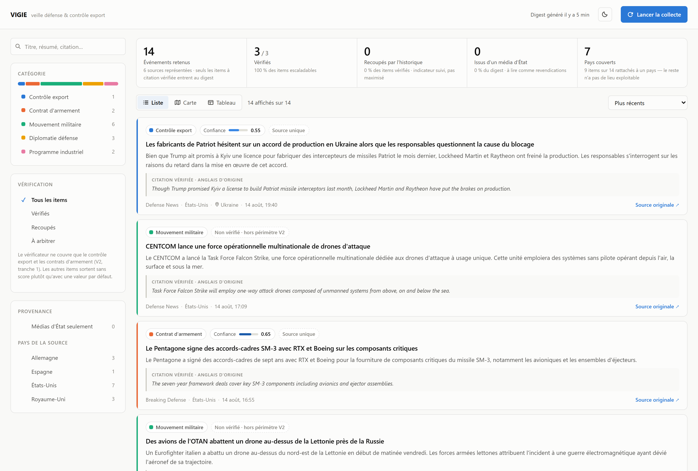

# VEILLE-01 — Agent de veille export & risque défense/géopolitique

Agent IA autonome qui collecte, classe et synthétise quotidiennement des sources ouvertes sur un périmètre défense/géopolitique restreint, avec traçabilité systématique de chaque affirmation vers sa source.

**Statut** : pipeline V1 fonctionnel de bout en bout (collecte → dédoublonnage → classification → vérification → API → frontend), première tranche du vérificateur V2 livrée, déploiement cloud à venir. Détail dans [Roadmap](#roadmap).



Le digest expose les signaux qui engagent la confiance plutôt que la seule liste d'articles : score de confiance du vérificateur, recoupement, provenance « média d'État », citation vérifiée verbatim. Un item hors du périmètre du vérificateur sort sans score plutôt qu'avec un zéro trompeur.


La carte est construite sur le champ `location` vérifié par item, pas sur le pays de la source, et affiche explicitement ce qu'elle ne peut pas placer — lieux non rattachables à un pays (espaces maritimes, détroits internationaux, régions transnationales). Une carte qui ne montrerait que ses succès surestimerait la couverture réelle.

Trois niveaux de rattachement sont comptés séparément et détaillés au survol, une couverture présumée ne devant pas se lire comme une couverture citée : le pays est **cité** par la source ; il est **déduit** par le modèle d'une localité nommée (« Darwin » → Australie) ; ou, à défaut de tout lieu nommé, l'événement est **présumé domestique** au pays du média — sur jugement du contenu de l'article, jamais sur la seule origine du média, qui placerait en Russie une dépêche TASS sur le Yémen.

## Cadrage

Cadrage complet — problématique, périmètre MECE, alternatives évaluées, KPIs, matrice de risques, gouvernance, plan de livraison — dans [`docs/cadrage.md`](docs/cadrage.md). Synthèse visuelle : [`docs/slides.html`](docs/slides.html) (support de présentation navigable, ouvrir dans un navigateur).

**Valeur** : diviser le temps de synthèse quotidienne, standardiser la lecture des signaux faibles, tracer la fiabilité de chaque information remontée.

**Périmètre V1** : export control, contrats d'armement, mouvements militaires, diplomatie défense, programmes industriels — filtrage thématique (le lieu est extrait comme métadonnée, sans restreindre la collecte, cf. cadrage §4).

**Sources** : 16 flux RSS gratuits, organisés par pays plutôt que par thème — les 10 premiers exportateurs mondiaux d'armement (classement SIPRI *Trends in International Arms Transfers*, données 2020-24) plus l'Iran et la Corée du Nord pour la couverture export-contrôle. Chaque flux est validé en direct avant intégration ; les sources d'État (seule option gratuite disponible pour plusieurs de ces pays) sont marquées `state_affiliated` et restent visibles comme telles en aval, plutôt que d'être exclues ou mélangées silencieusement au reste.

## Architecture

```
Sources (RSS par pays, presse spécialisée, communiqués)
        │
        ▼
  Agent collecteur ──► Mémoire courte ──► Agent analyste
   (backend/agents/     (dédoublonnage,     (classification, résumé,
    collector.py)        avant l'appel LLM)  citation vérifiée)
                          backend/memory/     backend/agents/analyst.py
                          store.py                   │
                                                      ▼
                                            Agent vérificateur
                                            (backend/agents/verifier.py)
                                            recoupement sur l'historique,
                                            score de confiance
                                                      │
                                                      ▼
                                     API (FastAPI) ──► Front (digest filtrable,
                                     backend/api/       carte de couverture)
                                     main.py             frontend/ (React + Vite)
```

Implémenté comme un `StateGraph` LangGraph (`backend/graph.py`) : chaque étape est un nœud, l'état partagé (`VeilleState`, `backend/state.py`) transporte les items d'un nœud à l'autre. Le dédoublonnage est placé *avant* l'appel LLM, pas après, pour ne pas consommer de budget sur des items déjà vus. LangSmith trace chaque nœud sans instrumentation manuelle.

**Le digest est une fenêtre glissante, pas la photographie du dernier run.** Le dédoublonnage écartant, avant tout appel LLM, ce qui a déjà été vu dans les sept derniers jours, une seconde collecte dans la même journée ne produit qu'une poignée d'items neufs. Servir ce résultat brut reviendrait à effacer l'affichage à chaque collecte. `GET /events` lit donc l'historique des items analysés sur une profondeur paramétrable (`?days=`, bornée par la rétention de 30 jours), et le même historique alimente la recherche de recoupement du vérificateur — un seul stock, deux usages.

**Persistance : une interface, deux implémentations** (`backend/memory/persistence.py`). Trois états survivent aux runs : le compteur de budget LLM, les liens déjà vus et l'historique analysé. En développement ce sont des fichiers JSON ; en production ce sont des documents Firestore, parce que le système de fichiers de Cloud Run est éphémère et propre à chaque instance. La différence n'est pas qu'un confort de persistance : avec un compteur sur disque local, `MAX_LLM_CALLS_PER_DAY` redeviendrait contournable par un simple redémarrage. La réservation d'appel est donc exposée comme une opération du stockage (`reserve_llm_call`), atomique par transaction côté Firestore, plutôt que comme une lecture-modification-écriture faite par l'appelant — qui serait correcte en local et fausse en multi-instance. Le backend local reste le défaut : rien ne part vers GCP sans `VEILLE_STORAGE=firestore` explicite.

**Workflow déterministe et boucle agentique, séparés volontairement.** Les nœuds `collect`/`deduplicate`/`analyze` forment un chemin de code fixe : un appel LLM par item, aucune décision dynamique du modèle — c'est le bon compromis pour une tâche de classification traçable et bon marché. Le nœud `verify` est le seul point d'autonomie réelle : pour les catégories les plus sensibles (`export_control`, `contrat_armement`), le modèle dispose d'un outil de recherche dans l'historique des items analysés et décide lui-même s'il l'appelle, combien de fois, avant de conclure. Cette escalade est bornée sur trois axes (catégories éligibles, nombre d'items par run, nombre d'itérations d'outil par item) pour que l'agentivité reste un coût maîtrisé et non proportionnel au volume collecté.

## Stack

| Composant       | Choix                                    | Statut                |
|-----------------|-------------------------------------------|------------------------|
| Orchestration   | LangGraph / LangChain                    | construit (V1)          |
| LLM             | Claude Haiku via `langchain-anthropic`   | construit (V1)          |
| Backend         | Python 3.13, FastAPI                     | construit (V1)          |
| Observabilité   | LangSmith (tracing natif par nœud)       | construit (V1)          |
| Frontend        | React + TypeScript + Vite                | construit (V1)          |
| Vérificateur (recoupement, score de confiance) | LangGraph + tool-calling borné | 1ʳᵉ tranche construite (catégories sensibles) |
| Carte de couverture interactive | d3-geo + Natural Earth, sur le champ `location` | construite (V2, 1ʳᵉ tranche) |
| Déploiement     | Cloud Run + Cloud Scheduler (cron)        | prévu                   |
| Stockage        | Fichiers JSON locaux (dev) / Firestore (production), derrière une interface unique | construit en local ; backend Firestore écrit mais **non validé contre une base réelle** |

## Structure du repo

```
vigie/
├── backend/
│   ├── agents/
│   │   ├── collector.py       # collecte RSS par pays, sources validées en direct
│   │   ├── analyst.py         # classification MECE, résumé FR, citation + lieu vérifiés
│   │   └── verifier.py        # recoupement + score de confiance (boucle tool-calling bornée)
│   ├── api/
│   │   └── main.py            # FastAPI : /health, /run, /events
│   ├── eval/
│   │   ├── build_sample.py    # échantillon stratifié pour mesurer la précision
│   │   ├── annotate.py        # annotation manuelle interactive
│   │   ├── score.py           # précision mesurée vs cible (cadrage §7)
│   │   └── candidates.py      # densité de candidats de recoupement, sans appel LLM
│   ├── memory/
│   │   ├── store.py           # dédoublonnage + historique analysé (recoupement et digest)
│   │   └── persistence.py     # fichiers JSON locaux (dev) ou Firestore (prod), même interface
│   ├── config.py               # sources RSS par pays, garde-fous obligatoires
│   ├── guardrails.py           # plafond d'appels LLM quotidien
│   ├── graph.py                 # assemblage StateGraph LangGraph
│   ├── state.py                 # schéma d'état partagé (VeilleState)
│   ├── requirements.txt
│   └── requirements-gcp.txt     # dépendance Firestore, déploiement uniquement
├── frontend/                    # React + TypeScript + Vite, appelle l'API réelle
│   └── src/
│       ├── components/          # digest filtrable, carte de couverture, vue tableau
│       └── lib/                 # taxonomie, filtres/tri, résolution des lieux
├── scripts/
│   └── daily_run.py             # lancement quotidien + journal de campagne (hors service)
├── tests/                       # pytest — LLM et flux RSS mockés
├── docs/
│   ├── cadrage.md               # cadrage produit (problématique, MECE, risques, KPIs)
│   └── slides.html              # support de présentation navigable
├── .env.example
└── README.md
```

## Démarrage rapide

```bash
git clone https://github.com/Adrien-1997/vigie-01.git
cd vigie-01

python -m venv .venv
source .venv/bin/activate        # .venv\Scripts\activate sous Windows

pip install -r backend/requirements.txt

cp .env.example .env             # renseigner ANTHROPIC_API_KEY, LANGCHAIN_API_KEY (LangSmith),
                                  # MAX_STEPS_PER_RUN, MAX_LLM_CALLS_PER_DAY (garde-fous obligatoires)

uvicorn backend.api.main:app --reload --port 8080
```

Dans un second terminal, pour le frontend :

```bash
cd frontend
npm install
npm run dev
```

Ouvrir `http://localhost:5173`, puis cliquer sur **Lancer la collecte** (déclenche `POST /run` — pipeline complet, ~5 min, consomme du budget LLM réel). L'URL de l'API est `http://localhost:8080` par défaut, surchargeable via `VITE_API_BASE`.

## Accumulation d'historique

Plusieurs décisions ouvertes — l'extension du vérificateur ([§10](docs/cadrage.md) V2) et les fils d'événements de la V3 — reposent sur une quantité qu'un historique court ne permet pas de mesurer : la proportion d'items ayant, dans l'historique, un voisin traitant du même dossier. Deux dépêches sur un même dossier à 48 h d'écart sont rares par construction ; la mesure n'a de sens que sur plusieurs semaines. Tant que le déclenchement automatique (Cloud Scheduler) n'est pas déployé, le pipeline est lancé une fois par jour à la main :

```bash
python -m scripts.daily_run              # le lancement quotidien
python -m scripts.daily_run --dry-run    # état de la campagne, sans consommer de budget
```

Le script journalise **chaque lancement**, y compris ceux qui ne produisent aucun item neuf et ceux qui échouent. Cette distinction ne se déduit pas de l'historique analysé : un jour sans nouveauté et un jour non lancé y laissent la même trace, alors que le premier est une mesure et le second un trou. `COLLECTION_LOOKBACK_HOURS` (48 h) borne ce qu'une collecte rattrape — un jour sauté est récupéré par le lancement suivant, deux jours consécutifs perdent définitivement les items publiés au-delà de la fenêtre. L'écart depuis le dernier lancement est donc mesuré et signalé à chaque run.

La mesure qu'alimente cette campagne se rejoue ensuite sans aucun appel LLM :

```bash
python -m backend.eval.candidates
```

## Roadmap

- [x] V1 — collecte + dédoublonnage + classification + résumé tracé + API + frontend
- [x] V1 — sources organisées par pays (top 10 exportateurs SIPRI + Iran/Corée du Nord), validées en direct
- [ ] V1 — déploiement Cloud Run + Cloud Scheduler
- [~] V2 — agent vérificateur : recoupement et score de confiance livrés sur les catégories sensibles ; extension aux autres catégories et `fetch_full_article` à venir
- [~] V2 — carte de couverture interactive livrée (filtrage par pays depuis le champ `location`) ; sectorisation par thème à venir
- [ ] V3 — raisonnement longitudinal sur l'historique : le pipeline actuel traite chaque item isolément, alors qu'une part du signal se situe entre les items (un dossier qui évolue, la fréquence d'un pays qui monte). Cinq tranches séquencées, cadrées en [§10](docs/cadrage.md) :
  - [ ] fils d'événements — regrouper les items d'un même dossier en fil chronologique
  - [ ] brief hebdomadaire — tendances de volume par catégorie/pays vs semaine précédente, chiffres issus d'une agrégation et non du modèle
  - [ ] détection de signal faible — concentration inhabituelle d'items corroborés sur un couple pays/catégorie
  - [ ] restitution temporelle — axe de temps des séries de volume, distinct du fil par dossier
  - [ ] mémoire interrogeable (requêtes en langage naturel)

## Métriques de suivi

Définitions et cibles détaillées dans [`docs/cadrage.md` §7](docs/cadrage.md). Mesure de précision de classification outillée dans `backend/eval/` (échantillonnage stratifié, annotation manuelle, score vs cible).

- Couverture des sources (nb sources actives / nb sources ciblées)
- Précision de classification (échantillon annoté manuellement)
- Temps de traitement bout en bout par cycle
- Taux de faux positifs jugés critiques par l'analyste

Deux mesures de précision ont été conduites (n=30 puis n=88 après la reconfiguration des sources). Les résultats, les correctifs de définition qu'ils ont déclenchés et les réserves méthodologiques qui les accompagnent sont détaillés en [§7](docs/cadrage.md) — y compris ce qui reste à revérifier avant de considérer le KPI comme tranché.

## Garde-fous (implémentés dès V1)

- `backend/guardrails.py` — plafond d'appels LLM par jour, testé dans les deux sens (déclenchement réel vérifié, run normal non affecté). Couvre aussi les appels du vérificateur, sans compteur séparé. Atteint, il **tronque** le run au lieu de l'annuler : les items déjà analysés sont enregistrés et servis, ceux qui n'ont pas été soumis au modèle restent collectables au cycle suivant, et l'API répond un succès partiel explicite (`truncated`) plutôt qu'une erreur — sans quoi le garde-fou de coût détruirait le travail qu'il vient de faire payer
- `backend/graph.py` — plafond de steps par run (`MAX_STEPS_PER_RUN`), appliqué via le `recursion_limit` LangGraph — protection contre une boucle d'agent incontrôlée (cadrage §8), testée dans les deux sens
- `backend/agents/verifier.py` — double plafond sur l'escalade agentique : nombre d'items escaladés par run et nombre d'itérations d'outil par item. Vérifié en code et non via `MAX_STEPS_PER_RUN`, qui compte les nœuds du graphe et ne borne pas une boucle interne à un nœud
- `backend/agents/collector.py` — fenêtre de fraîcheur (`COLLECTION_LOOKBACK_HOURS`) : plusieurs flux institutionnels exposent des mois d'historique sans pagination par date ; sans ce filtre, un premier run soumettrait tout l'arriéré au budget quotidien d'un seul coup
- `backend/agents/analyst.py` — traçabilité systématique : un résumé sans citation vérifiable dans le texte source est rejeté automatiquement, pas seulement signalé

Les deux premiers garde-fous étaient initialement déclarés en config sans être vérifiés en code — écart trouvé par auto-audit et corrigé, plutôt que découvert en revue externe. C'est le type de vérification qu'un audit technique répété périodiquement pendant le développement doit attraper.

## Qualité & CI

- Lint et format : `ruff` (config dans `pyproject.toml`)
- Tests : `pytest` (`tests/`, LLM et flux RSS mockés — rapides, déterministes, sans coût)
- CI : `.github/workflows/ci.yml`, lance lint + format + tests sur chaque push/PR

## Note

Projet de démonstration à vocation portfolio. Le pipeline et l'API sont réels et fonctionnels (sources RSS live, appels LLM réels, mesures réelles) ; le déploiement cloud reste à construire, et le vérificateur ne couvre pour l'instant que les catégories les plus sensibles — les autres items sortent sans score de confiance plutôt qu'avec un score fabriqué par défaut.
